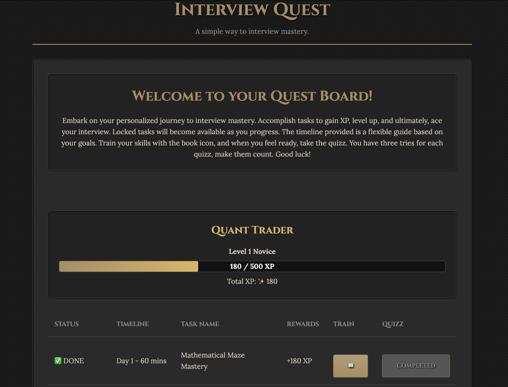
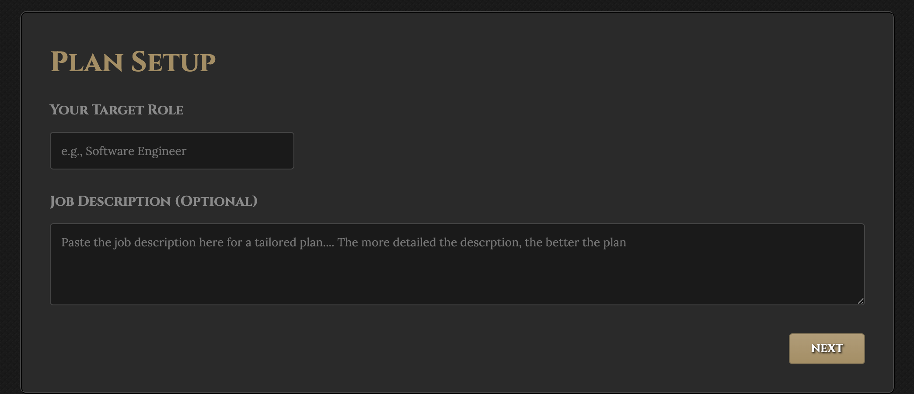
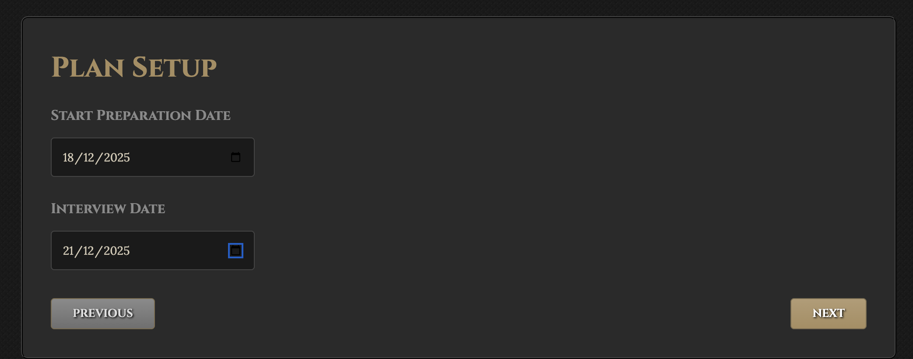
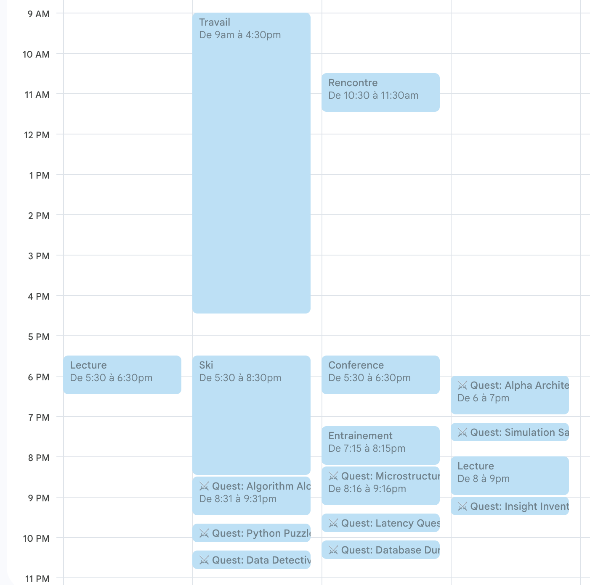
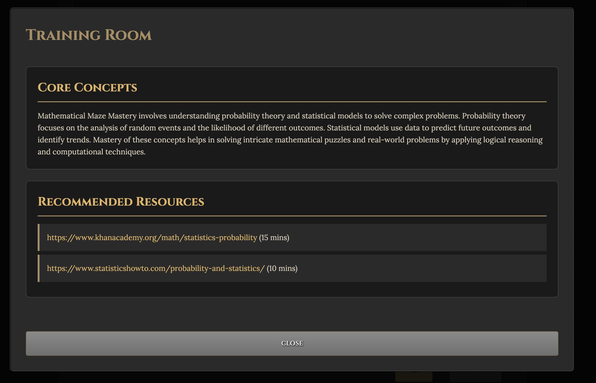
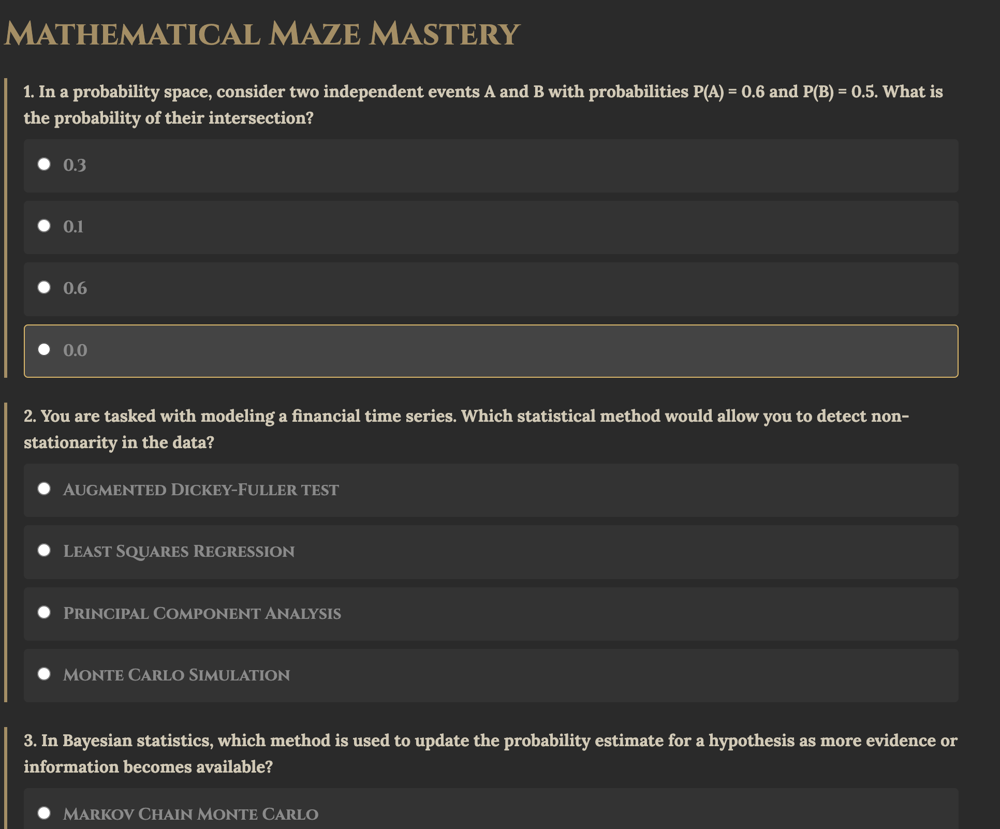
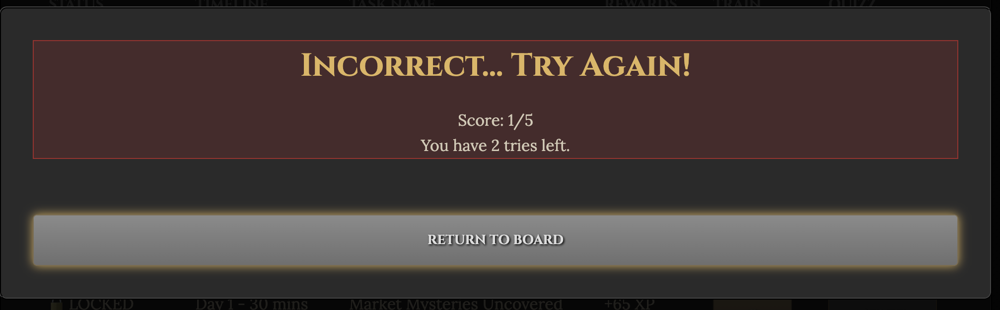
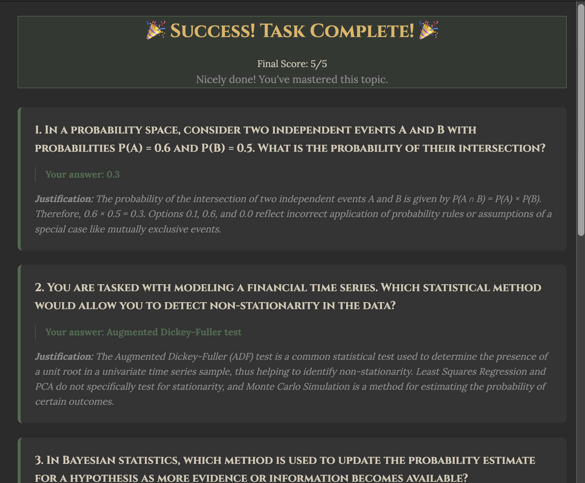

# Interview-preparation

Welcome to Interview Quest ! The easiest way to prepare for an interview.

## Features

This is an interview preparation app that gives you a complete list of task to complete. You progress by reading and practicing.

Setup takes only 20 seconds, no more losing time!

Tasks can be added to your Google Calendar for easier enagement!*

Each task has specific tailored reading material and a custom generated quiz.

You have 3 tries per quiz, make them count!

Don't worry, if you fail 3 times, a new set of questions will be generated. 

Completing a quiz gives you feedback so you can strenghten your understanding.

## Setup

1. Clone this repository locally.

2. Go to the project directory.

3. Create a virtual environnement with venv.

4. Install the requirements.

`pip install -r requirements.txt`

5. Set the OPENAI_API_KEY=sk-... environnement variable

Optionnaly 

## Start

1. Run the main.py file from the virtual environnement.

2. Open the app on the localhost http://localhost:8080

## How it works

Give the app a desired role.
You can optionally give a job description. 

Tell it how much time you are willing to spend per day. 

The app will fill your calendar with tasks to do if you integrate with Google Calendar. 

You will receive a board filled with tasks for each day leading to the deadline. Each task has specific readings and a quiz.

*Google Calendar integration requires you to setup a client_secret.json at the root directory of the project to enable OAUTH2. Look here for more details https://developers.google.com/identity/protocols/oauth2